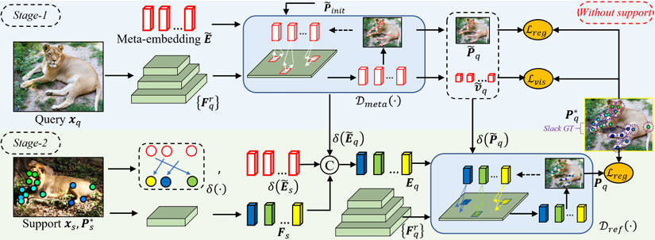

## Paper

CVPR 2024

[Meta-Point Learning and Refining for Category-Agnostic Pose Estimation]([https://openaccess.thecvf.com/content_cvpr_2016/papers/He_Deep_Residual_Learning_CVPR_2016_paper.pdf](https://openaccess.thecvf.com/content/CVPR2024/papers/Chen_Meta-Point_Learning_and_Refining_for_Category-Agnostic_Pose_Estimation_CVPR_2024_paper.pdf))

**Junjie chen**, Jiebin Yan, Yuming Fang, and Li Niu

[**Project**](https://github.com/chenbys/MetaPoint)   <!-- <strong></strong> -->
- First to learn class-agnostic potential keypoints for CAPE. 

- **Junjie Chen**, Weilong Chen, Yifan Zuo, and Yuming Fang. "Recurrent Feature Mining and Keypoint Mixup Padding for Category-Agnostic Pose Estimation." `In CVPR 2025`.
- **Junjie Chen**, Li Niu, Siyuan Zhou, Jianlou Si, Chen Qian, and Liqing Zhang. "Weak-shot Semantic Segmentation via Dual Similarity Transfer." `In NeurIPS 2022`.
- **Junjie Chen**, Li Niu, Liu Liu, and Liqing Zhang. "Weak-shot fine-grained classification via similarity transfer." `In NeurIPS 2021`.
- **Junjie Chen**, Li Niu, and Liqing Zhang. "Depth Privileged Scene Recognition via Dual Attention Hallucination." `IEEE Trans. Image Process. 30 (2021): 9164-9178`.
- **Junjie Chen**, Li Niu, Jianfu Zhang, Jianlou Si, Chen Qian, and Liqing Zhang. "Amodal Instance Segmentation via Prior-guided Expansion." `In AAAI 2023`.
- Yi Tu, Li Niu, **Junjie Chen**, Dawei Cheng, and Liqing Zhang. "Learning from web data with self-organizing memory module." `In CVPR 2020`.
- Yan Liu, Zhijie Zhang, Li Niu, **Junjie Chen**, and Liqing Zhang. "Mixed supervised object detection by transferring mask prior and semantic similarity." `In NeurIPS 2021`.
- Jieteng Yao, **Junjie Chen**, Li Niu, Bin Sheng. Scene-aware Human Pose Generation using Transformer. `In ACM MM 2023`.
- Zhijie Zhang, Yan Liu, **Junjie Chen**, Li Niu, and Liqing Zhang. "Depth Privileged Object Detection in Indoor Scenes via Deformation Hallucination." `In AAAI 2021`.
- Jiangtong Li, Wentao Wang, **Junjie Chen**, Li Niu, Jianlou Si, Chen Qian, and Liqing Zhang. "Video Semantic Segmentation via Sparse Temporal Transformer." `In ACM MM 2021`.

 

---

## Research Project

1. 国家自然科学基金-青年科学基金项目。
2. 江西省自然科学基金-青年科学基金项目。
3. 江西省职业早期人才培养项目。
4. 校级一般教育教学改革课题。
   

   

 
